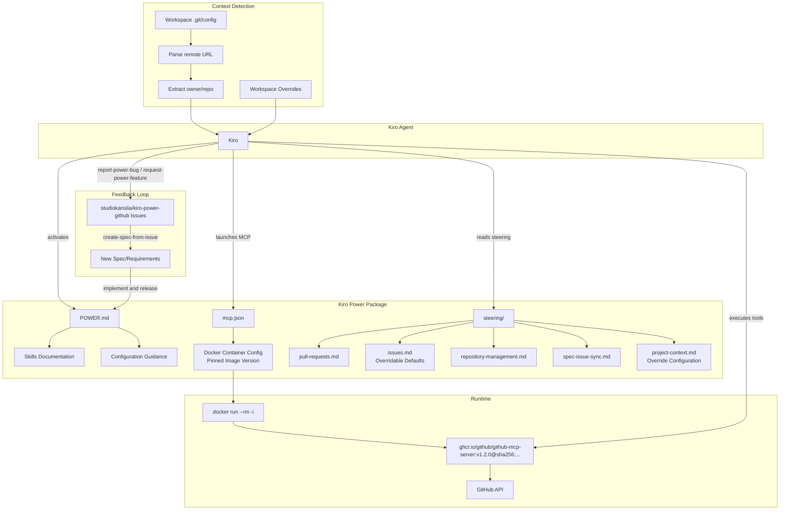
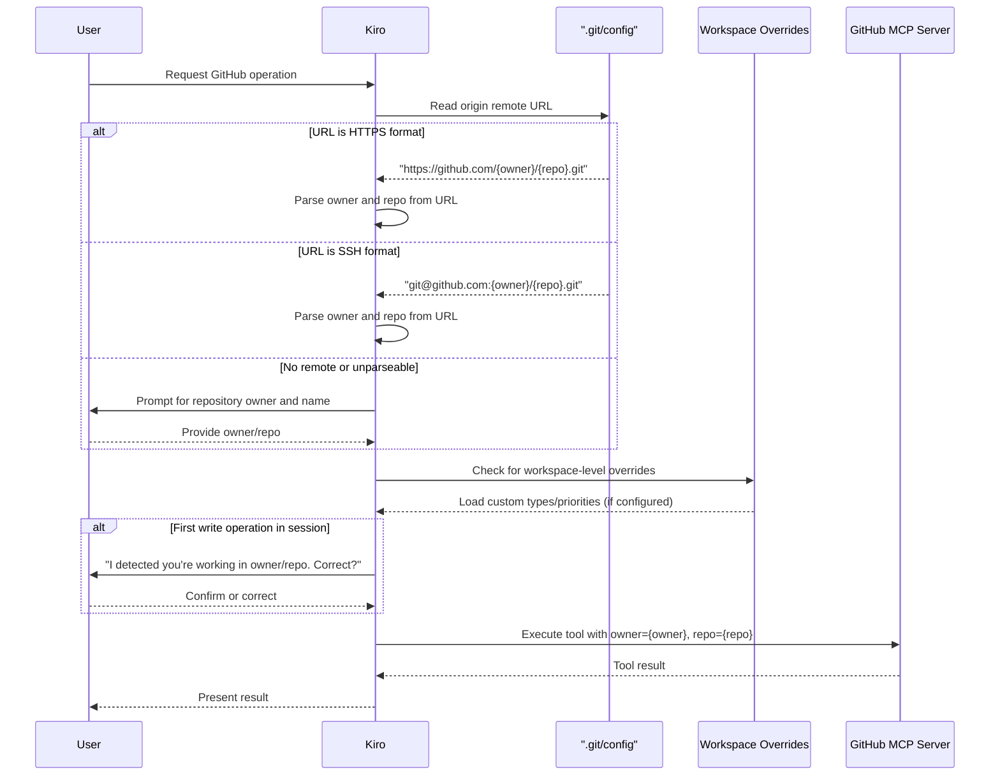
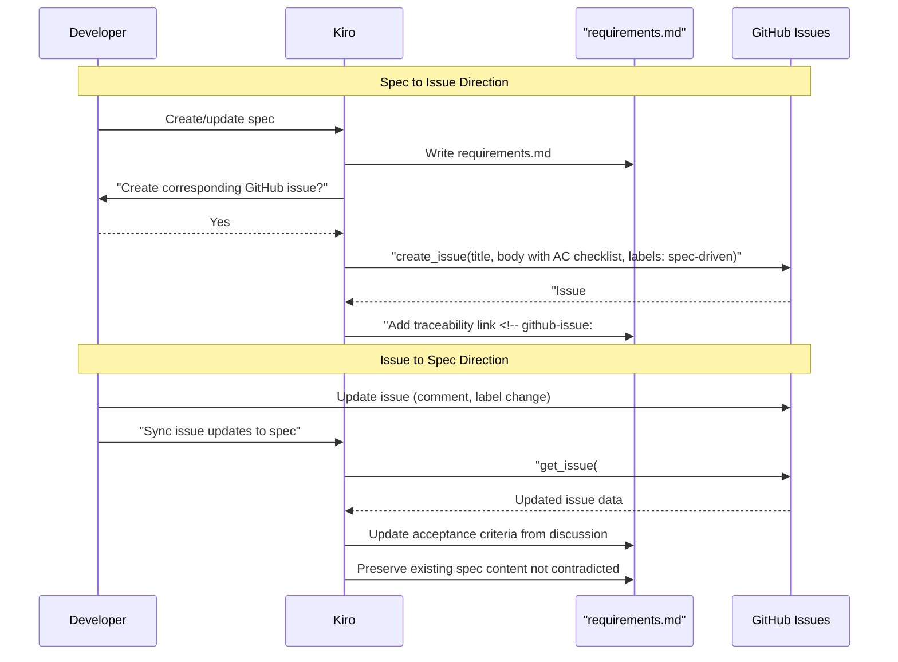
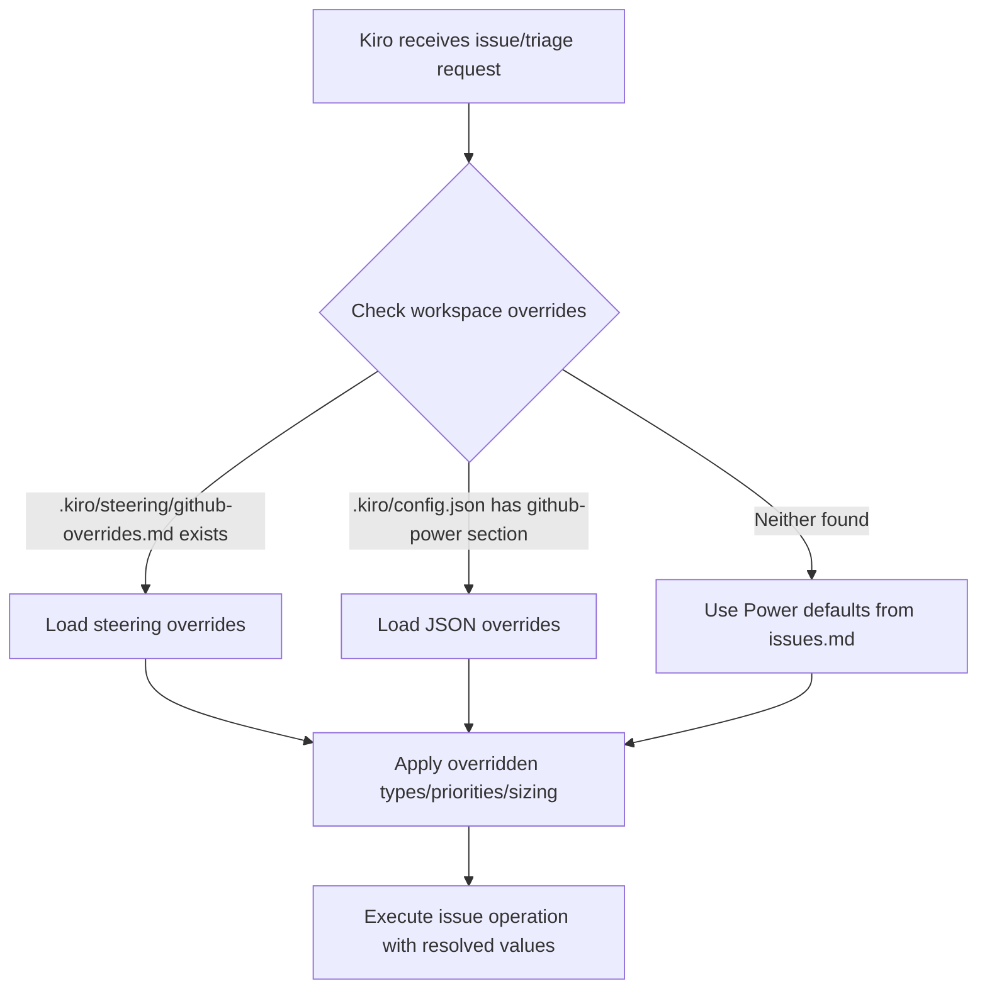
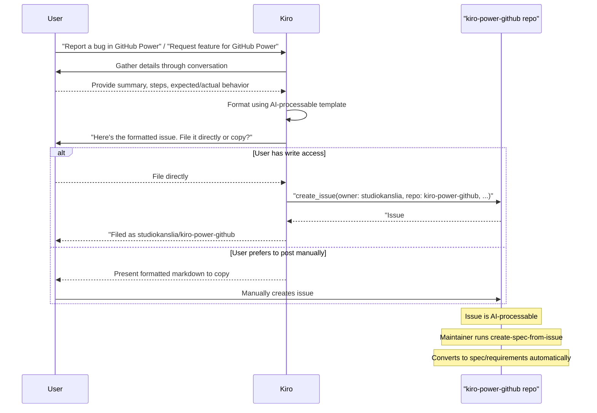

# Technical Design Document

## Overview

The **kiro-power-github** Power is a Guided MCP Power that bundles the official GitHub MCP server (running in Docker) with curated steering files, skills documentation, and release automation. It provides Kiro with:

1. **GitHub API Interaction** — A pre-configured Docker-based MCP server (`ghcr.io/github/github-mcp-server`) that exposes 50+ GitHub tools (issues, PRs, repositories, code search, etc.) via stdio transport, compatible with web agent and cloud sandbox environments.
2. **Guided Workflows via Steering Files** — Five markdown steering files that instruct Kiro on best practices for pull requests, issues, repository management, spec-issue synchronization, and project context detection.
3. **Reusable Skills** — Seven documented skill workflows (create-feature-pr, file-bug-report, create-release, review-pull-requests, create-spec-from-issue, report-power-bug, request-power-feature) that Kiro can execute as multi-step guided actions.
4. **Self-Sustained Development** — A dogfooding model where the Power's own development is managed using its own steering and skills after the v0.1.0 bootstrap.
5. **Automated Releases** — A GitHub Actions pipeline triggered by semver tags that validates version consistency, verifies image pinning, and publishes releases.
6. **Workspace-Aware Configuration** — Overridable defaults for issue types, priority levels, and label taxonomies that adapt to each project's conventions while providing sensible defaults out of the box.
7. **Feedback Loop** — Built-in skills that allow users to report bugs or request features for the Power itself, filing well-structured issues directly to the `studiokanslia/kiro-power-github` repository that are AI-processable and can be converted to specs/requirements.

The Power is designed to be globally installable while remaining context-aware — it automatically detects the workspace repository from git remote configuration and scopes all operations accordingly. Default conventions (P0-P3 priorities, bug/feature/chore types) can be overridden at the workspace level to match project-specific taxonomies.

## Architecture

The Power follows a layered architecture where each layer serves a distinct role:



### Key Architectural Decisions

| Decision | Rationale |
|----------|-----------|
| Docker-based MCP server | Required for web agent/cloud sandbox compatibility; ensures isolated, reproducible execution |
| Pinned container image with digest | Prevents supply chain attacks via tag mutation; ensures reproducible builds; digest verification guarantees exact image content |
| stdio transport (not SSE/HTTP) | The `-i` flag enables stdin/stdout communication, which is the standard MCP transport for local container execution |
| Secret via Kiro configuration | `GITHUB_PERSONAL_ACCESS_TOKEN` is managed by Kiro's secret system and injected via `-e` flag at runtime — never embedded in images or committed to repos |
| Five separate steering files | Each covers a distinct concern, loaded on-demand by Kiro when relevant keywords are detected |
| Overridable defaults in steering | Issue types and priorities are configurable at workspace level, enabling projects to use their own taxonomies (MoSCoW, T-shirt sizing, custom vocabularies) |
| Project context via git remote | Enables global installation while automatically scoping operations to the current workspace repository |
| Semver from v0.1.0 | Communicates maturity and change impact from the first release |
| GitHub Actions for releases | Tag-based triggers provide a simple, auditable release mechanism with image pinning validation |
| Hardcoded Power repo for feedback skills | `report-power-bug` and `request-power-feature` always target `studiokanslia/kiro-power-github` regardless of workspace context, ensuring feedback reaches the Power maintainers |
| AI-processable issue templates | Structured templates with metadata comments enable automated conversion from user-filed issues to formal specs via `create-spec-from-issue` |

## Components and Interfaces

### 1. File/Directory Structure

```
kiro-power-github/
├── POWER.md                          # Main Power documentation with frontmatter
├── mcp.json                          # MCP server configuration (pinned image)
├── CHANGELOG.md                      # Keep a Changelog format
├── LICENSE                           # Repository license
├── README.md                         # GitHub repository README
├── steering/
│   ├── pull-requests.md              # PR creation, review, merge guidance
│   ├── issues.md                     # Issue creation, triage, templates (overridable defaults)
│   ├── repository-management.md      # Branches, releases, repo settings
│   ├── spec-issue-sync.md            # Bidirectional spec ↔ issue sync
│   └── project-context.md            # Workspace repo detection, scoping & override config
└── .github/
    └── workflows/
        └── release.yml               # Semver tag-triggered release pipeline (with image pin validation)
```

### 2. POWER.md Structure

The POWER.md file is the entry point for Kiro when activating the Power. It contains YAML frontmatter followed by structured documentation.

**Frontmatter Schema:**

```yaml
---
name: github-mcp
displayName: GitHub MCP
description: "Guided Power for GitHub workflows — bundles Docker-based MCP server, steering files for PRs/issues/repos, and reusable skills."
version: "0.1.0"
keywords:
  - github
  - mcp
  - pull-request
  - issues
  - repository
  - docker
  - automation
author: studiokanslia
---
```

**Document Sections (in order):**

1. **Overview** — What the Power provides (3 capabilities with 1-2 sentence descriptions)
2. **Configuration** — Prerequisites, Docker setup, Kiro secret configuration, token scopes, networking, image pinning policy
3. **Available Steering Files** — Table listing all 5 steering files with descriptions
4. **Skills** — Detailed skill documentation (7 skills with inputs, steps, outputs)
5. **Tool Usage Examples** — At least 3 GitHub MCP tool invocation examples
6. **Best Practices** — At least 3 concrete recommendations for GitHub workflows
7. **Troubleshooting** — Container, authentication, and permission error scenarios
8. **Image Update Process** — Steps for safely updating the pinned container image
9. **Workspace Overrides** — How to configure custom issue types, priorities, and labels
10. **Contributing** — Dogfooding workflow description
11. **Feedback & Reporting** — How to report bugs or request features for the Power itself

### 3. mcp.json Configuration

The `mcp.json` declares how Kiro should launch the GitHub MCP server with a **pinned image reference**:

```json
{
  "mcpServers": {
    "github": {
      "command": "docker",
      "args": [
        "run",
        "--rm",
        "-i",
        "-e",
        "GITHUB_PERSONAL_ACCESS_TOKEN",
        "ghcr.io/github/github-mcp-server:v1.2.0@sha256:a1b2c3d4e5f6a7b8c9d0e1f2a3b4c5d6e7f8a9b0c1d2e3f4a5b6c7d8e9f0a1b2"
      ],
      "env": {
        "GITHUB_PERSONAL_ACCESS_TOKEN": "${secret:GITHUB_PERSONAL_ACCESS_TOKEN}"
      }
    }
  }
}
```

**Design Notes:**
- `"command": "docker"` — The top-level command is the Docker CLI
- `"--rm"` — Ensures container cleanup after process exit (prevents stopped container accumulation)
- `"-i"` — Interactive mode for stdin/stdout stdio transport (no `-t` since there's no TTY)
- `"-e", "GITHUB_PERSONAL_ACCESS_TOKEN"` — Passes the environment variable into the container
- `"env"` block — Declares the secret reference for Kiro's configuration system to resolve
- **Image pinning** — The image reference uses both a version tag (`v1.2.0`) AND a SHA256 digest (`@sha256:...`) for defense-in-depth: the tag provides human readability while the digest ensures immutable content verification
- No `-d` flag — Container runs in foreground for stdio communication
- No port mappings — Communication is via stdio, not network

**Image Pinning Policy:**
- The image MUST always be referenced with both a version tag and SHA256 digest
- The tag alone is insufficient as tags are mutable (can be re-pushed to point to different content)
- The digest ensures that even if a tag is maliciously re-pushed, the exact image bytes are verified
- Example format: `ghcr.io/github/github-mcp-server:v1.2.0@sha256:<64-char-hex>`

### 4. Image Update Process

When a new version of the GitHub MCP server image is released, the pinned reference must be updated carefully:

**Steps to Update:**

1. **Verify provenance** — Check the new release on the official GitHub repository (`github/github-mcp-server`). Confirm the release is from the official maintainers and review the changelog for breaking changes.

2. **Pull and verify the new image** — Pull by tag and capture the digest:
   ```bash
   docker pull ghcr.io/github/github-mcp-server:v1.3.0
   docker inspect --format='{{index .RepoDigests 0}}' ghcr.io/github/github-mcp-server:v1.3.0
   ```

3. **Test the new version** — Run the container locally with the new image and verify MCP tool availability:
   ```bash
   echo '{"jsonrpc":"2.0","method":"initialize","params":{},"id":1}' | \
     docker run --rm -i -e GITHUB_PERSONAL_ACCESS_TOKEN ghcr.io/github/github-mcp-server:v1.3.0
   ```

4. **Update mcp.json** — Replace the image reference with the new tag and verified digest:
   ```json
   "ghcr.io/github/github-mcp-server:v1.3.0@sha256:<new-digest>"
   ```

5. **Update CHANGELOG** — Add an entry under the next version documenting the image version bump.

6. **Create PR** — File a PR with the updated `mcp.json` and CHANGELOG entry. The release workflow will validate the image is properly pinned.

7. **Tag and release** — After merge, tag a new MINOR or PATCH version to trigger the release pipeline.

**Automation Note:** The release workflow includes a validation step that fails if the image reference in `mcp.json` is not pinned (see Section 6 - Release Workflow).

### 5. Steering File Interfaces

Each steering file follows a consistent structure:

```markdown
# [Topic] Steering

## When This Applies
[Trigger conditions for Kiro to load this steering]

## Workflows
[Step-by-step instructions for each workflow]

## Templates
[Reusable templates for common operations]

## Rules & Constraints
[Hard rules Kiro must follow]

## Examples
[Concrete examples demonstrating correct behavior]
```

#### 5.1 `steering/pull-requests.md`

**Purpose:** Guides Kiro through PR creation, review, and merge workflows.

**Key Content:**
- PR title constraint: max 72 characters
- Required description sections: Summary, Changes, Testing
- Label taxonomy: type labels (feature, bugfix, chore, hotfix, docs) and scope labels (frontend, backend, infra, docs)
- Review checklist: coding conventions, test presence, breaking changes, TODO/FIXME audit
- Merge strategy decision matrix: squash (single-feature), merge commit (long-lived branches), rebase (≤3 commits, linear)
- Template with populated example sections
- Validation rule: if any required section is missing, prompt user before proceeding

#### 5.2 `steering/issues.md`

**Purpose:** Guides Kiro through issue creation, triage, and lifecycle management. Defines **overridable defaults** for issue types and priority levels.

**Key Content:**
- Title constraint: max 72 characters
- Issue types (GitHub native): Bug, Feature, Task
- Label set: `bug`, `feature`, `chore`, `documentation`, `enhancement`
- Priority levels: P0-critical, P1-high, P2-medium, P3-low
- Templates for: bug reports (title, description, steps to reproduce, expected/actual behavior, environment), feature requests (title, description, motivation, acceptance criteria), tasks (title, description, subtasks, definition of done)
- Modern GitHub features: sub-issues for hierarchical breakdown, tasklists for trackable subtasks, issue types as first-class categorization
- Triage workflow: assign priority, categorize by type, link related issues
- GitHub Projects v2 integration: auto-add to project, set custom fields

**Overridable Defaults:**
- The default issue types (`bug`, `feature`, `chore`) and priority levels (`P0-P3`) are **workspace-overridable defaults**
- When workspace-level overrides are detected (via project-context.md configuration), the overridden values replace these defaults for all issue operations
- The steering file documents the override mechanism and provides examples of common alternative taxonomies
- See Section 10 (Workspace Configuration Overrides) for the full override mechanism

#### 5.3 `steering/repository-management.md`

**Purpose:** Guides Kiro through branch management, releases, and repository configuration.

**Key Content:**
- Branch naming: `{prefix}/{description}` with prefixes: `feature/`, `bugfix/`, `chore/`, `release/`, `hotfix/`; max 100 chars; separator is `/`
- Branch name validation: inform user of violation, suggest correction
- Release workflow: semver tag format `vMAJOR.MINOR.PATCH`, changelog entry structure (date + categories: Added, Changed, Fixed, Removed), release notes with summary + change list
- Repository settings guidance: default branch naming, branch protection (required reviews, status checks), merge strategy defaults
- GitHub Actions automation guidance: issue triage, PR labeling, stale issue management, project board automation
- No references to deprecated features (Projects v1, etc.)

#### 5.4 `steering/spec-issue-sync.md`

**Purpose:** Guides Kiro through bidirectional synchronization between spec documents and GitHub issues.

**Key Content:**
- **Spec → Issue**: When a spec (requirements.md) is created, offer to create a GitHub issue with: requirement title as issue title, acceptance criteria as checklist, `spec-driven` label, priority and type labels
- **Issue → Spec**: When a GitHub issue is updated (comments, status, labels), reflect changes back into the spec document (updating acceptance criteria based on discussion)
- **Linking Convention**: Issue number in spec doc (e.g., `<!-- github-issue: #42 -->`), spec file path in issue body (e.g., `Spec: .kiro/specs/{name}/requirements.md`)
- **Mapping Rules**: One requirement → one GitHub issue; sub-tasks in spec → sub-issues (not flat checkboxes)
- **Update Preservation**: When syncing, preserve manual additions/comments on issues
- **Labels on sync**: `spec-driven`, priority label, type label, related issue references (`Related to #123`)
- Modern features: use sub-issues and tasklists for hierarchical breakdown, tracked-by/tracks relationships for dependencies
- **Override awareness**: Issue types and priority labels used during sync respect workspace-level overrides

#### 5.5 `steering/project-context.md`

**Purpose:** Instructs Kiro on detecting and using the current workspace's repository context, **including workspace-level configuration overrides**.

**Key Content:**
- **Detection Method**: Parse `origin` remote URL from workspace git configuration
- **URL Formats Supported**:
  - HTTPS: `https://github.com/{owner}/{repo}.git` → extract owner, repo
  - SSH: `git@github.com:{owner}/{repo}.git` → extract owner, repo
- **Fallback**: If no git remote is configured or URL cannot be parsed, prompt user for owner and repo
- **Scoping**: All MCP tool invocations receive resolved `owner` and `repo` parameters automatically
- **Re-detection**: Re-detect context each time a new workspace is entered or GitHub operation is initiated
- **Confirmation**: On first write operation in a session, confirm detected repo with user (e.g., "I detected you're working in `owner/repo`. Is this correct?")
- **Skill Inheritance**: All skills inherit detected context — users don't manually specify owner/repo

**Override Configuration:**
- Documents where workspace-level overrides are defined (workspace steering files or `.kiro` configuration)
- Lists which defaults can be overridden: issue types, priority levels, label taxonomies, effort sizing
- Specifies override detection order: workspace `.kiro/steering/` → project root `.kiro/` config → Power defaults
- Instructs Kiro to load and apply overrides before any issue/triage operation
- See Section 10 (Workspace Configuration Overrides) for the full mechanism and examples

### 6. GitHub Actions Release Workflow

**File:** `.github/workflows/release.yml`

```yaml
name: Release

on:
  push:
    tags:
      - 'v[0-9]+.[0-9]+.[0-9]+'

jobs:
  validate-and-release:
    runs-on: ubuntu-latest
    permissions:
      contents: write
    steps:
      - uses: actions/checkout@v4

      - name: Extract version from tag
        id: tag_version
        run: echo "VERSION=${GITHUB_REF_NAME#v}" >> $GITHUB_OUTPUT

      - name: Validate version matches POWER.md
        run: |
          POWER_VERSION=$(grep -oP '^version:\s*"\K[^"]+' POWER.md)
          if [ "$POWER_VERSION" != "${{ steps.tag_version.outputs.VERSION }}" ]; then
            echo "ERROR: Tag version (${{ steps.tag_version.outputs.VERSION }}) does not match POWER.md version ($POWER_VERSION)"
            exit 1
          fi

      - name: Validate CHANGELOG entry exists
        run: |
          if ! grep -q "## \[${{ steps.tag_version.outputs.VERSION }}\]" CHANGELOG.md; then
            echo "ERROR: No CHANGELOG entry found for version ${{ steps.tag_version.outputs.VERSION }}"
            exit 1
          fi

      - name: Validate Docker image is pinned
        run: |
          IMAGE_REF=$(grep -oP 'ghcr\.io/github/github-mcp-server[^"]*' mcp.json)
          echo "Image reference: $IMAGE_REF"
          
          # Check that image has a version tag (not 'latest' or untagged)
          if ! echo "$IMAGE_REF" | grep -qP ':[v]?\d+\.\d+\.\d+'; then
            echo "ERROR: Docker image must be pinned to a specific version tag (e.g., :v1.2.0)"
            echo "Found: $IMAGE_REF"
            exit 1
          fi
          
          # Check that image has a SHA256 digest
          if ! echo "$IMAGE_REF" | grep -qP '@sha256:[a-f0-9]{64}'; then
            echo "ERROR: Docker image must include a SHA256 digest (e.g., @sha256:abc123...)"
            echo "Found: $IMAGE_REF"
            exit 1
          fi
          
          echo "Image reference is properly pinned with version tag and digest."

      - name: Create GitHub Release
        uses: softprops/action-gh-release@v2
        with:
          tag_name: ${{ github.ref_name }}
          name: "v${{ steps.tag_version.outputs.VERSION }}"
          generate_release_notes: true
          files: |
            POWER.md
            mcp.json
            CHANGELOG.md
            steering/*
```

**Design Decisions:**
- Tag pattern `v[0-9]+.[0-9]+.[0-9]+` matches semver format exactly
- Version validation step ensures POWER.md frontmatter version matches the pushed tag
- CHANGELOG validation ensures documentation accompanies every release
- **Image pinning validation** ensures the Docker image in mcp.json is always referenced with both a version tag AND a SHA256 digest — releases will fail if the image is unpinned
- Release assets include all Power package files for easy consumption
- `generate_release_notes: true` auto-generates notes from commits since last release
- Permissions scoped to `contents: write` (minimum needed for release creation)

### 7. Project Context Detection Flow



### 8. Spec-Issue Sync Bidirectional Flow



### 9. CHANGELOG.md Structure

Follows the [Keep a Changelog](https://keepachangelog.com/) format:

```markdown
# Changelog

All notable changes to this project will be documented in this file.

The format is based on [Keep a Changelog](https://keepachangelog.com/en/1.1.0/),
and this project adheres to [Semantic Versioning](https://semver.org/spec/v2.0.0.html).

## [Unreleased]

## [0.1.0] - YYYY-MM-DD

### Added
- Initial Power package structure (POWER.md, mcp.json)
- Docker-based GitHub MCP server configuration with pinned image
- Steering file: pull-requests.md
- Steering file: issues.md (with overridable defaults)
- Steering file: repository-management.md
- Steering file: spec-issue-sync.md
- Steering file: project-context.md (with override configuration)
- Skills: create-feature-pr, file-bug-report, create-release, review-pull-requests, create-spec-from-issue, report-power-bug, request-power-feature
- GitHub Actions release pipeline (tag-triggered, with image pin validation)
- Semantic versioning from v0.1.0
- Workspace-level override support for issue types and priorities
- Feedback loop skills: report-power-bug, request-power-feature (AI-processable issue templates)

[Unreleased]: https://github.com/studiokanslia/kiro-power-github/compare/v0.1.0...HEAD
[0.1.0]: https://github.com/studiokanslia/kiro-power-github/releases/tag/v0.1.0
```

**Versioning Policy (documented in POWER.md):**
- **PATCH** (0.1.x): Bug fixes, documentation typos, steering file clarifications, image version bumps
- **MINOR** (0.x.0): New steering files, new skills, new MCP configuration options, new override capabilities
- **MAJOR** (x.0.0): Breaking changes to Power structure, mcp.json format changes, steering file renames

### 10. Workspace Configuration Overrides

This section defines how workspace-level context can override the Power's default issue types, priority levels, and label taxonomies.

#### Override Philosophy

The Power ships with sensible defaults (P0-P3 priorities, bug/feature/chore types) that work for most projects. However, many teams use different conventions. Rather than forcing a single taxonomy, the Power allows workspace-level configuration to replace these defaults entirely.

#### What Can Be Overridden

| Category | Power Default | Override Examples |
|----------|--------------|------------------|
| Priority levels | P0-critical, P1-high, P2-medium, P3-low | MoSCoW (Must have, Should have, Could have, Won't have), Numbered (1-5), Custom |
| Issue types | bug, feature, chore | defect, story, task, spike, epic |
| Type labels | `bug`, `feature`, `chore`, `documentation`, `enhancement` | `defect`, `story`, `spike`, `tech-debt`, `improvement` |
| Effort sizing | (none by default) | T-shirt (XS, S, M, L, XL), Story points (1, 2, 3, 5, 8, 13), Hours |
| Scope labels | frontend, backend, infra, docs | Custom domain labels per project |

#### Override Configuration Location

Overrides are detected from workspace-level configuration in the following priority order (first match wins):

1. **Workspace steering file** — `.kiro/steering/github-overrides.md` in the project root
2. **Kiro workspace config** — `.kiro/config.json` with a `github-power` section
3. **Power defaults** — Built-in values from `steering/issues.md`

#### Override Format: Steering File (Preferred)

The preferred override mechanism is a workspace-level steering file at `.kiro/steering/github-overrides.md`:

```markdown
# GitHub Power Overrides

## Priority Levels
- Must have (critical, blocks release)
- Should have (important, needed for release)  
- Could have (nice to have, defer if needed)
- Won't have (explicitly out of scope for now)

## Issue Types
- defect (replaces "bug" — something broken)
- story (replaces "feature" — user-facing capability)
- task (replaces "chore" — technical/maintenance work)
- spike (time-boxed research/investigation)

## Effort Sizing
- XS (< 1 hour)
- S (1-4 hours)
- M (1-2 days)
- L (3-5 days)
- XL (> 1 week, should be broken down)

## Label Mapping
| Override Type | Override Label | Maps To |
|--------------|---------------|---------|
| defect | `defect` | (replaces `bug`) |
| story | `story` | (replaces `feature`) |
| task | `task` | (replaces `chore`) |
```

#### Override Format: JSON Config (Alternative)

For teams preferring structured configuration, `.kiro/config.json`:

```json
{
  "github-power": {
    "priorities": [
      { "name": "Must have", "description": "Critical, blocks release" },
      { "name": "Should have", "description": "Important, needed for release" },
      { "name": "Could have", "description": "Nice to have, defer if needed" },
      { "name": "Won't have", "description": "Explicitly out of scope" }
    ],
    "issueTypes": [
      { "name": "defect", "replaces": "bug", "description": "Something broken" },
      { "name": "story", "replaces": "feature", "description": "User-facing capability" },
      { "name": "task", "replaces": "chore", "description": "Technical/maintenance work" }
    ],
    "effortSizing": {
      "enabled": true,
      "scale": "tshirt",
      "values": ["XS", "S", "M", "L", "XL"]
    }
  }
}
```

#### How Overrides Are Applied



#### Override Behavior Rules

1. **Full replacement** — Overrides replace the entire category, not individual items. If you override priorities, you must define all priority levels you want used.
2. **Label mapping** — When types are overridden, the corresponding labels in templates and triage workflows use the new names.
3. **Steering reference** — The `project-context.md` steering instructs Kiro to check for overrides before any issue operation.
4. **Template adaptation** — Issue templates adapt to use the overridden terminology (e.g., "Priority: Must have" instead of "Priority: P1-high").
5. **Backward compatibility** — If overrides are removed, the Power falls back to its built-in defaults without any configuration change.

#### Common Override Examples

**Example 1: MoSCoW Priorities**
```markdown
## Priority Levels
- Must have (critical path, release blocker)
- Should have (high value, release goal)
- Could have (desirable, defer if needed)
- Won't have (acknowledged, not this cycle)
```

**Example 2: Custom Issue Types for a Design System**
```markdown
## Issue Types
- defect (visual or behavioral regression)
- component (new component request)
- enhancement (improvement to existing component)
- documentation (docs update needed)
- deprecation (component to be removed)
```

**Example 3: Story Points Sizing**
```markdown
## Effort Sizing
- 1 (trivial, < 30 min)
- 2 (small, < 2 hours)
- 3 (medium, half day)
- 5 (large, full day)
- 8 (very large, 2-3 days)
- 13 (epic-sized, needs breakdown)
```

### 11. Skills Documentation Structure

Each skill in POWER.md follows this schema:

```markdown
### Skill: {skill-name}

**Description:** One-sentence description of what the skill does.

**Required Inputs:**
- `input_name` (source: user | context) — Description

**Steps:**
1. [Action description] → Tool: `tool_name(params)`
2. [Action description] → Tool: `tool_name(params)`
...

**Expected Output:** What the skill produces (URL, number, summary, etc.)

**Example Invocation:** Natural language trigger example
```

**Skills Defined:**

| Skill | Description | Key Tools Used |
|-------|-------------|----------------|
| `create-feature-pr` | Creates a feature branch, commits changes, and opens a PR with structured description | `create_branch`, `create_or_update_file`, `create_pull_request` |
| `file-bug-report` | Creates a bug report issue with reproduction steps and priority (uses workspace overrides for type/priority) | `create_issue`, `add_issue_comment` |
| `create-release` | Tags a release, generates changelog entry, creates GitHub release | `create_tag`, `create_release` |
| `review-pull-requests` | Reviews open PRs checking conventions, tests, breaking changes | `list_pull_requests`, `get_pull_request_files`, `create_pull_request_review` |
| `create-spec-from-issue` | Fetches an issue and generates a structured requirements.md | `get_issue`, `list_issue_comments`, `get_issue` (related) |
| `report-power-bug` | Reports a bug in the GitHub Power itself to `studiokanslia/kiro-power-github` with structured reproduction details | `create_issue` (targets Power repo) |
| `request-power-feature` | Requests a new feature for the GitHub Power itself, filed to `studiokanslia/kiro-power-github` with structured description | `create_issue` (targets Power repo) |

### 12. Feedback Loop: Reporting Issues to the Power Itself

The Power includes built-in skills that enable users to report bugs or request features **for the Power itself**, creating a direct feedback loop from users to the `studiokanslia/kiro-power-github` repository. This supports the dogfooding model by making it trivial for users to contribute back.

#### Design Philosophy

- Users should be able to say "report a bug in the GitHub Power" or "request a feature for the GitHub Power" and Kiro handles the rest
- Issues filed are **AI-processable** — structured so they can be picked up by `create-spec-from-issue` and converted into formal requirements
- The target repository is always `studiokanslia/kiro-power-github` (hardcoded in these two skills, unlike other skills which use workspace context)
- Users can choose to file the issue directly (if they have write access) or receive the formatted issue content to post manually

#### Skill: `report-power-bug`

**Description:** Files a structured bug report against the kiro-power-github repository itself.

**Trigger Phrases:**
- "Report a bug in the GitHub Power"
- "I found a problem with the GitHub Power"
- "File a defect for kiro-power-github"

**Required Inputs:**
- `summary` (source: user) — One-sentence description of the bug
- `steps_to_reproduce` (source: user) — What the user was doing when the bug occurred
- `expected_behavior` (source: user) — What should have happened
- `actual_behavior` (source: user) — What actually happened
- `affected_component` (source: user | context) — Which part of the Power is affected (steering file, skill, mcp.json, POWER.md)

**Optional Inputs:**
- `environment` (source: context) — Kiro version, Docker version, OS (auto-detected if possible)
- `severity` (source: user) — How impactful the bug is

**Steps:**
1. Gather bug details from user through conversational prompts
2. Auto-detect environment context (Kiro version, Docker info) if available
3. Format the issue body using the AI-processable bug template (see below)
4. Confirm the formatted issue with the user
5. Either:
   - a) File directly → `create_issue(owner: "studiokanslia", repo: "kiro-power-github", title, body, labels: ["bug", "user-reported"])`
   - b) Present formatted content for user to post manually

**Expected Output:** Issue URL (if filed directly) or formatted markdown content ready to paste

**AI-Processable Bug Template:**

```markdown
## Bug Report

**Summary:** [one-line description]

**Affected Component:** [steering/{file} | skill/{name} | mcp.json | POWER.md | release pipeline]

### Environment
- Kiro Version: [version]
- Docker Version: [version]
- OS: [os]
- Power Version: [version from POWER.md frontmatter]

### Reproduction Steps
1. [step 1]
2. [step 2]
3. [step 3]

### Expected Behavior
[what should happen]

### Actual Behavior
[what actually happens]

### Severity
[critical | high | medium | low]

### Additional Context
[any relevant logs, screenshots, or configuration]

---
<!-- ai-processable: true -->
<!-- source: report-power-bug skill -->
<!-- convertible-to-spec: yes -->
```

#### Skill: `request-power-feature`

**Description:** Files a structured feature request against the kiro-power-github repository itself.

**Trigger Phrases:**
- "Request a feature for the GitHub Power"
- "I wish the GitHub Power could..."
- "Suggest an improvement for kiro-power-github"

**Required Inputs:**
- `title` (source: user) — Short description of the desired feature
- `motivation` (source: user) — Why this feature is needed / what problem it solves
- `desired_behavior` (source: user) — What the feature should do

**Optional Inputs:**
- `acceptance_criteria` (source: user) — Specific conditions that define "done"
- `alternatives_considered` (source: user) — Other approaches the user considered
- `affected_area` (source: user) — Which part of the Power would change

**Steps:**
1. Gather feature details from user through conversational prompts
2. Help user articulate acceptance criteria (suggest if user is unsure)
3. Format the issue body using the AI-processable feature template (see below)
4. Confirm the formatted issue with the user
5. Either:
   - a) File directly → `create_issue(owner: "studiokanslia", repo: "kiro-power-github", title, body, labels: ["enhancement", "user-requested"])`
   - b) Present formatted content for user to post manually

**Expected Output:** Issue URL (if filed directly) or formatted markdown content ready to paste

**AI-Processable Feature Template:**

```markdown
## Feature Request

**Title:** [short description]

**Affected Area:** [steering/{file} | skill/{name} | mcp.json | POWER.md | new steering | new skill]

### Motivation
[why this feature is needed — what problem does it solve?]

### Desired Behavior
[what should the feature do?]

### Acceptance Criteria
- [ ] [criterion 1]
- [ ] [criterion 2]
- [ ] [criterion 3]

### Alternatives Considered
[other approaches and why they were rejected]

### Impact
- **Users affected:** [all users | specific workflow users | power maintainers]
- **Breaking change:** [yes | no]
- **Suggested priority:** [Must have | Should have | Could have | Won't have]

---
<!-- ai-processable: true -->
<!-- source: request-power-feature skill -->
<!-- convertible-to-spec: yes -->
```

#### Feedback Flow



#### Why AI-Processable Format Matters

The templates include structured sections and metadata comments (`<!-- ai-processable: true -->`, `<!-- convertible-to-spec: yes -->`) that enable:

1. **Automated spec generation** — The `create-spec-from-issue` skill can parse these issues and generate well-formed requirements documents automatically
2. **Consistent structure** — Every bug/feature follows the same format, making batch processing reliable
3. **Acceptance criteria as checkboxes** — Directly convertible to acceptance criteria in requirements.md
4. **Component tagging** — Identifies which part of the Power is affected, enabling routing and prioritization
5. **Severity/priority metadata** — Enables automated triage workflows

This creates a complete loop: user reports issue → AI converts to spec → developer implements → user benefits from improvement.

## Data Models

### POWER.md Frontmatter Schema

| Field | Type | Required | Constraints |
|-------|------|----------|-------------|
| `name` | string | Yes | Must be `github-mcp` |
| `displayName` | string | Yes | Must be `GitHub MCP` |
| `description` | string | Yes | ≤ 300 characters, ≤ 3 sentences |
| `version` | string | Yes | Semver format (e.g., `0.1.0`) |
| `keywords` | string[] | Yes | Must include: github, mcp, pull-request, issues, repository |
| `author` | string | Yes | Non-empty string |

### mcp.json Schema

```typescript
interface McpConfig {
  mcpServers: {
    [serverName: string]: {
      command: string;        // "docker"
      args: string[];         // ["run", "--rm", "-i", "-e", "GITHUB_PERSONAL_ACCESS_TOKEN", "<pinned-image-ref>"]
      env: {
        [key: string]: string; // {"GITHUB_PERSONAL_ACCESS_TOKEN": "${secret:GITHUB_PERSONAL_ACCESS_TOKEN}"}
      };
    };
  };
}

// Image reference format (last element in args array):
// "ghcr.io/github/github-mcp-server:<version-tag>@sha256:<64-hex-chars>"
// Example: "ghcr.io/github/github-mcp-server:v1.2.0@sha256:a1b2c3d4..."
```

**Image Reference Constraints:**
- MUST include a version tag matching pattern `v\d+\.\d+\.\d+`
- MUST include a SHA256 digest matching pattern `@sha256:[a-f0-9]{64}`
- MUST NOT use `latest` tag
- MUST NOT omit the tag (bare image name)

### Workspace Override Schema

```typescript
interface WorkspaceOverrides {
  priorities?: PriorityDefinition[];
  issueTypes?: IssueTypeDefinition[];
  effortSizing?: EffortSizingConfig;
  labels?: LabelMapping[];
}

interface PriorityDefinition {
  name: string;           // e.g., "Must have"
  description: string;    // e.g., "Critical, blocks release"
}

interface IssueTypeDefinition {
  name: string;           // e.g., "defect"
  replaces?: string;      // e.g., "bug" (maps to Power default being replaced)
  description: string;    // e.g., "Something broken"
}

interface EffortSizingConfig {
  enabled: boolean;
  scale: "tshirt" | "points" | "hours" | "custom";
  values: string[];       // e.g., ["XS", "S", "M", "L", "XL"]
}

interface LabelMapping {
  overrideType: string;   // The new type name
  label: string;          // The GitHub label to apply
  mapsTo?: string;        // Which Power default it replaces
}
```

### Skill Definition Schema

```typescript
interface SkillDefinition {
  name: string;                    // e.g., "create-feature-pr"
  description: string;             // One-sentence description
  inputs: SkillInput[];            // Required inputs
  steps: SkillStep[];              // Ordered execution steps
  expectedOutput: string;          // What the skill produces
}

interface SkillInput {
  name: string;                    // e.g., "branch_name"
  source: "user" | "context";     // User-provided or from project context
  description: string;             // What the input is
}

interface SkillStep {
  order: number;                   // Execution order
  action: string;                  // Human-readable action description
  tool: string;                    // GitHub MCP tool name
  params: Record<string, string>;  // Tool parameters (may reference inputs or prior outputs)
}
```

### Feedback Issue Schema

```typescript
interface PowerFeedbackIssue {
  type: "bug" | "feature";
  targetRepo: {
    owner: "studiokanslia";        // Always targets the Power's own repo
    repo: "kiro-power-github";     // Hardcoded — not derived from workspace context
  };
  title: string;                   // Max 72 characters
  affectedComponent: string;       // e.g., "steering/issues.md", "skill/create-feature-pr"
  body: string;                    // Formatted using AI-processable template
  labels: string[];                // ["bug", "user-reported"] or ["enhancement", "user-requested"]
  metadata: {
    aiProcessable: true;           // Always true — enables automated spec generation
    convertibleToSpec: true;       // Always true — structured for create-spec-from-issue
    source: "report-power-bug" | "request-power-feature";
  };
}
```

### Steering File Metadata

| File | Trigger Keywords | Scope |
|------|-----------------|-------|
| `pull-requests.md` | pull request, PR, merge, review | PR lifecycle |
| `issues.md` | issue, bug, feature request, triage, defect, story, report power bug, request power feature | Issue lifecycle (with overridable defaults) |
| `repository-management.md` | branch, release, tag, repo settings | Repository operations |
| `spec-issue-sync.md` | spec, sync, requirements, track | Spec ↔ issue synchronization |
| `project-context.md` | repository, context, workspace, owner, override, config | Context detection & override configuration |

### GitHub Token Scope Requirements

| Operation Category | Required Scopes (Fine-Grained) | Classic Token Scope |
|-------------------|-------------------------------|---------------------|
| Repository (read/write) | Contents: Read and write | `repo` |
| Issues (read/write) | Issues: Read and write | `repo` (included) |
| Pull Requests (read/write) | Pull requests: Read and write | `repo` (included) |
| Releases (read/write) | Contents: Read and write | `repo` (included) |
| Organization (read) | Organization: Read | `read:org` |

## Error Handling

### Container Errors

| Error Scenario | Symptom | Resolution |
|----------------|---------|------------|
| Docker not installed | `command not found: docker` | Install Docker Desktop or Docker Engine |
| Docker not running | `Cannot connect to the Docker daemon` | Start Docker service (`systemctl start docker` or open Docker Desktop) |
| Image pull failure | `manifest unknown` or network timeout | Verify network access to `ghcr.io`; run `docker logout ghcr.io` if stale credentials |
| Digest mismatch | `image with reference was found but does not match the specified platform` | The pinned digest may be for a different architecture; verify correct platform digest |
| Pinned image not found | `manifest for ... not found` | The pinned version may have been removed from registry; update to latest verified version following Image Update Process |
| Container exits immediately | MCP connection drops | Check Docker logs; ensure `-i` flag is present (not `-d`) |
| OOM kill | Container killed unexpectedly | Increase Docker memory limit |

### Authentication Errors

| Error Scenario | Symptom | Resolution |
|----------------|---------|------------|
| Missing token | `401 Unauthorized` on all requests | Configure `GITHUB_PERSONAL_ACCESS_TOKEN` in Kiro secrets |
| Expired token | `401 Bad credentials` | Regenerate token in GitHub Settings → Developer settings → Tokens |
| Insufficient scopes | `403 Resource not accessible` | Identify required scope from token scope table; add scope to token |
| Wrong repository access | `404 Not Found` for existing repo | Ensure fine-grained token has access to the specific repository |

### Context Detection Errors

| Error Scenario | Symptom | Resolution |
|----------------|---------|------------|
| No git repository | No `.git` directory found | Initialize git repo or navigate to a git workspace |
| No remote configured | `origin` remote not found | Add remote: `git remote add origin <url>` |
| Unparseable remote URL | Non-GitHub remote (e.g., GitLab, Bitbucket) | Prompt user for owner/repo manually |
| Wrong repository detected | Operations target unexpected repo | User corrects during confirmation prompt |

### Override Configuration Errors

| Error Scenario | Symptom | Resolution |
|----------------|---------|------------|
| Malformed override steering | Override file exists but cannot be parsed | Warn user, fall back to Power defaults, suggest fixing syntax |
| Empty priority/type list | Override defines category but with no values | Warn user that at least one value is required; use Power defaults |
| Conflicting overrides | Both steering file and JSON config define overrides | Use priority order (steering file wins); warn about duplicate |
| Unknown override category | Override file references unsupported configuration | Ignore unknown sections; warn user about supported override categories |

### Steering Validation Errors

| Error Scenario | Behavior |
|----------------|----------|
| PR description missing required sections | Prompt user to provide missing sections before proceeding |
| Branch name violates convention | Inform user of violation, suggest corrected name |
| Issue missing priority assignment | Prompt user to select priority level (using overridden values if configured) |
| Spec-issue link not found | Offer to create the link or search for matching issue |

## Testing Strategy

### Why Property-Based Testing Does NOT Apply

This Power consists entirely of:
- **Markdown documentation** (POWER.md, steering files, CHANGELOG.md)
- **JSON configuration** (mcp.json)
- **YAML frontmatter** (metadata in POWER.md)
- **YAML workflow definitions** (GitHub Actions)

There are no pure functions, algorithms, or business logic to test with property-based testing. The Power is a **documentation and configuration package**, not executable application code. Testing focuses on structural validation and integration verification.

### Applicable Testing Strategies

#### 1. Schema Validation Tests (Unit)

- **POWER.md frontmatter**: Validate YAML parses correctly, required fields present, `name` = `github-mcp`, `description` ≤ 300 chars, `keywords` contains required terms, `version` matches semver pattern
- **mcp.json**: Validate JSON parses correctly, server entry has `command`, `args`, `env` fields, args array contains required Docker flags, **image reference is pinned with version tag and SHA256 digest**
- **CHANGELOG.md**: Validate structure follows Keep a Changelog format

#### 2. Content Validation Tests (Unit)

- **Steering files**: Validate each file exists in `steering/` directory, is valid markdown, contains required sections (When This Applies, Workflows, Rules)
- **Skills documentation**: Validate POWER.md contains all 7 documented skills with required schema fields (name, description, inputs, steps, outputs)
- **Token scopes table**: Validate documentation covers all required operation categories
- **Override documentation**: Validate issues.md documents the override mechanism and project-context.md documents override configuration

#### 3. Image Pinning Validation Tests (Unit)

- **Version tag format**: Validate image reference contains a version tag matching `v\d+\.\d+\.\d+`
- **SHA256 digest format**: Validate image reference contains `@sha256:` followed by 64 hex characters
- **No latest tag**: Validate image reference does not contain `:latest`
- **No bare image name**: Validate image reference is not just `ghcr.io/github/github-mcp-server` without tag/digest

#### 4. Integration Tests

- **Docker container launch**: Verify `docker run --rm -i -e GITHUB_PERSONAL_ACCESS_TOKEN ghcr.io/github/github-mcp-server:<pinned-version>` starts and responds to MCP initialization
- **Tool availability**: Verify key tools (create_issue, create_pull_request, list_issues) are exposed by the MCP server
- **Secret injection**: Verify token is accessible inside the container when passed via `-e`
- **Digest verification**: Verify pulled image digest matches the pinned digest in mcp.json

#### 5. Release Pipeline Tests

- **Version consistency**: CI validates POWER.md version matches git tag
- **CHANGELOG presence**: CI validates CHANGELOG has entry for release version
- **Image pinning**: CI validates mcp.json image reference includes version tag and SHA256 digest
- **Workflow syntax**: GitHub Actions workflow linter validates `release.yml`

#### 6. Linting

- **Markdown lint**: All `.md` files pass markdownlint rules
- **JSON lint**: `mcp.json` passes JSON schema validation
- **YAML lint**: POWER.md frontmatter passes YAML lint

### Test Execution

Tests can be implemented as a simple shell script or CI job that:
1. Parses POWER.md frontmatter and validates fields
2. Parses mcp.json and validates structure (including image pinning)
3. Checks steering/ directory has exactly 5 expected files
4. Validates CHANGELOG.md structure
5. Validates version consistency
6. Validates image reference format (tag + digest)
7. Optionally runs Docker integration test (requires Docker + token)

```bash
# Example validation script structure
#!/bin/bash
set -euo pipefail

# 1. Validate POWER.md frontmatter
# 2. Validate mcp.json schema
# 3. Validate image pinning (version tag + SHA256 digest)
# 4. Validate steering files exist
# 5. Validate CHANGELOG structure
# 6. Validate version consistency
# 7. Check override documentation in issues.md and project-context.md
```
